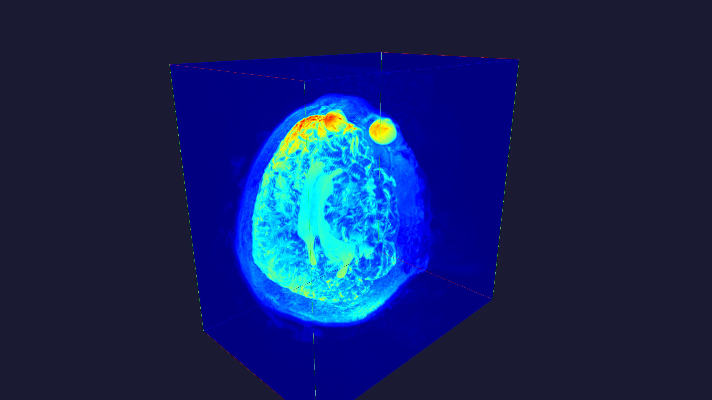

```
____________________________
 __  __  __      __  _____  
|  \/  | \ \    / / |  __ \ 
| |\/| |  \ \  / /  | |__) |
| |  | |   \ \/ /   |  _  / 
|_|  |_|    \__/    |_| \_\ 
MVR - Medical Volume Renderer
____________________________
```

# Medical Volume Renderer (v0)

A lightweight OpenGL-based 3D volume renderer with a simple PyQt6 UI. Supports loading NIfTI (.nii, .nii.gz) and DICOM (.dcm) files and basic camera controls, colormap presets, and a slicer mode.

## Releases

The release binary(standalone) and library(.so) is available in the `releases` directory. It is a Linux binary that can be run on any Linux system.

- renderer0: First release binary. Supports loading NIfTI files.
- renderer1: Second release binary. Supports loading DICOM files also.
- renderer-x86_64: Latest release binary. Supports loading NIfTI and DICOM files.


You can use the `volumerenderer` library (`volumerenderer.cpython-313-x86_64-linux-gnu`) and put it in some standard path like: `/usr/include/..` to avoid building the backend.

## Quick Start (Linux)

1. Build the native backend and Python bindings:
   ```bash
   ./build.sh
   ```

2. Run the app:
   ```bash
   cd frontend
   ./run main.py
   ```

   If using NVIDIA PRIME offload, you can set:
   ```bash
   __NV_PRIME_RENDER_OFFLOAD=1 __GLX_VENDOR_LIBRARY_NAME=nvidia QT_XCB_GL_INTEGRATION=xcb_glx ./run main.py
   ```

3. Load a NIfTI file from the UI ("Load NIfTI/DICOM File") or use the History dropdown.

## Basic Controls

- Mouse drag (LMB): Orbit camera
- Mouse wheel: Zoom
- History: Load a NIfTI file from the UI ("Load NIfTI/DICOM File") or use the History dropdown.
- Buttons: Reset View, Z/Y/X-normal for axis-aligned views
- Toggles: Show Bounding Box, Show Overlay
- Colormap: Choose from presets (Grayscale, Viridis-like, etc.)
- Slicer: Enable and sweep through slices along Z/Y/X

## Save/Export

- Save Image: Export the GL render (without overlay). Choose resolution.
- Save Screen: Screenshot the entire window (UI included).

## Screenshots




## Notes

- On startup, the title bar shows the current FPS; the in-scene overlay shows File, FPS, and GPU memory.
- For NVIDIA GPU usage in the overlay, install `nvidia-ml-py3` or ensure `nvidia-smi` is available.

## Use pre-built binary

You can use the pre-built binary in the `releases` directory. Now v0 is available for Linux. Not to expect for Windows and macOS, although it is possible to build it on those platforms, with some additional steps.


```bash
cd path/to/MedicalVolumeRenderer
chmod +x releases/renderer0
./releases/renderer0
```


## Installation (Linux)

Below are minimal steps tested on Ubuntu/Debian-like systems.

1) System packages

```bash
sudo apt update
sudo apt install -y \
  build-essential cmake git \
  python3 python3-venv python3-pip \
  pybind11-dev \
  dcmtk libdcmtk-dev \
  libnifti-dev zlib1g-dev libnsl-dev \
  mesa-utils
```

2) OPTIONAL: Build and install NIfTI C library (required by the backend)

```bash
cd ~/Downloads
git clone https://github.com/NIFTI-Imaging/nifti_clib.git
cd nifti_clib
mkdir build && cd build
cmake .. -DCMAKE_POSITION_INDEPENDENT_CODE=ON -DBUILD_SHARED_LIBS=ON
make -j"$(nproc)"
sudo make install
sudo ldconfig
```

Alternately you can use the `volumerenderer` library (`volumerenderer.cpython-313-x86_64-linux-gnu`) and put it in some standard path like: `/usr/include/..` so that you dont have to build any external library.

3) Python environment and dependencies

```bash
# navigate
cd /path/to/MedicalVolumeRenderer

# create and activate virtual environment
python3 -m venv .mvr

# activate virtual environment
source .mvr/bin/activate

# upgrade pip
pip install --upgrade pip

# install dependencies
pip install numpy pandas matplotlib scipy
pip install pybind11-dev
pip install dcmtk libdcmtk-dev
pip install libnifti-dev zlib1g-dev libnsl-dev
pip install PyQt6 pyqtgraph

# Optional (for GPU memory overlay on NVIDIA):
pip install nvidia-ml-py3
```

4) Build this project

```bash
./build.sh
```

5) Run the app

```bash
cd frontend
./run main.py
```

NVIDIA PRIME offload (optional on hybrid laptops):

```bash
__NV_PRIME_RENDER_OFFLOAD=1 __GLX_VENDOR_LIBRARY_NAME=nvidia QT_XCB_GL_INTEGRATION=xcb_glx ./run main.py
```

If you see OpenGL errors, verify your GPU driver and OpenGL setup (e.g., `glxinfo | grep -E "OpenGL vendor|renderer|version"`).


## License

MIT License

## Contact

Akash Maji <akashmaji@gmail.com>


